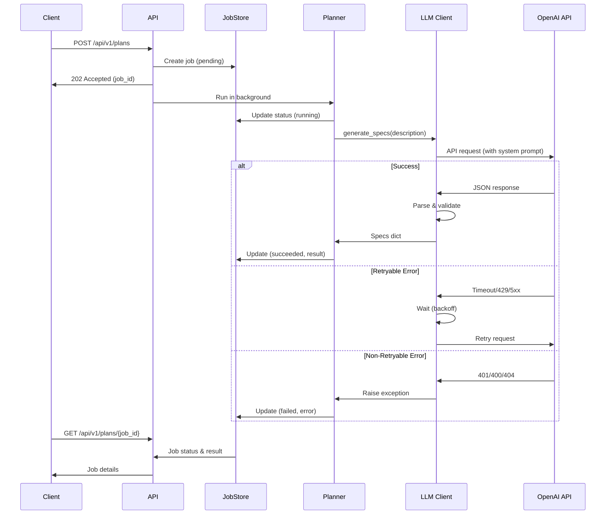

# Instructions for implementing LLM apis

The following is instructions for implementing with LLM APIs. The models that are currently targeted are the OpenAI GPT5+ models, the Anthropic Claude Sonnet/Opus 4+ models, and Google Gemini 3+ models.

**Important:** Always use the latest stable API versions and official SDKs. Avoid deprecated endpoints and legacy APIs.

## Current Implementation Status

**✅ Implemented:**
- OpenAI GPT-4/5 series (via Chat Completions API)

**🚧 Planned:**
- Anthropic Claude Sonnet/Opus 4 (via Messages API)
- Google Gemini 3 (via Gemini API)

**Note**: Currently, only OpenAI is supported. The architecture is designed to be provider-agnostic through the `BaseLLMClient` abstraction, but concrete implementations for Anthropic and Google are not yet available.

## OpenAI GPT5

When implementing OpenAI integration, the target API should be the **Responses API** since it is the recommended most long term compatible option. The GPT 5 series models are supportive of the responses API and these are the models we want to use when implementing AI integration. Do not use completions it is not recommended moving forward.

- Target model: `gpt-5.1`
- Use the official `openai` Python package or equivalent SDK for your language

**Do NOT use:** Completions API (deprecated), legacy models like GPT-3.5 or older

### Current Implementation Details

The Software Planner uses the OpenAI Chat Completions API with the following characteristics:

**SDK**: `openai==2.14.0` (official Python SDK)

**API Endpoint**: Chat Completions (`/v1/chat/completions`)

**Request Format**:
```python
response = client.chat.completions.create(
    model="gpt-5.1",
    messages=[
        {"role": "system", "content": system_prompt},
        {"role": "user", "content": user_description}
    ],
    temperature=0.7,
    max_tokens=2000
)
```

**Retry Logic**:
- Max retries: 3 attempts
- Backoff: Exponential (1s → 2s → 4s → 8s, capped at 10s)
- Retryable errors: Timeouts, rate limits (429), connection errors, 5xx server errors
- Non-retryable errors: Authentication (401), bad request (400), not found (404)

**Timeout**: Configurable via `LLM_TIMEOUT` (default: 60 seconds per attempt)

## Anthropic Claude Sonnet/Opus 4

When implementing Anthropic integration, the target API should be the **Messages API** (API version `2023-06-01` or newer) since it is the most long term compatible option. The Claude Sonnet 4 and Opus 4 series models are supportive of the Messages API and these are the models we want to use when implementing AI integration.

- Target model: Sonnet 4.5
- Use the official `anthropic` Python package or `@anthropic-ai/sdk` for JS/TS

**Do NOT use:** Text Completions API (deprecated), Claude 2.x or older models

**Status**: Not yet implemented. The `BaseLLMClient` abstraction is ready for a concrete Anthropic implementation.

## Google Gemini 3

When implementing Google integration, the target API should be the **Gemini API** since it is the most long term compatible option. The Gemini 3 series models are supportive of the Gemini API and these are the models we want to use when implementing AI integration.

- Target model: `gemini-3.0-pro`
- Use the official `google-genai` Python package or `@google/genai` for JS/TS
- Ex. `from google import genai`

**Do NOT use:** PaLM API (deprecated), Gemini 1.x models, or legacy Bard endpoints

**Status**: Not yet implemented. The `BaseLLMClient` abstraction is ready for a concrete Google implementation.

## General Best Practices

- Always check official documentation for the latest API versions
- Use environment variables for API keys, never hardcode them
- Implement proper error handling and rate limiting
- Use streaming responses when available for better UX
- Keep SDKs updated to the latest stable versions

---

# Operational Guide

This section describes how the LLM integration operates at runtime, including logging, monitoring, error handling, and troubleshooting.

## Runtime Behavior

### Planning Flow

When a planning job is submitted, the system follows this flow:



### System Prompt and Response Structure

The LLM is instructed via a system prompt to generate specs in a specific JSON format:

**Default System Prompt** (simplified):
> You are a software planning assistant. Generate a structured software plan.
> 
> Your response MUST be valid JSON only:
> ```json
> {
>   "specs": [
>     {
>       "purpose": "string",
>       "vision": "string",
>       "must": ["array of strings"],
>       "dont": ["array of strings"],
>       "nice": ["array of strings"]
>     }
>   ]
> }
> ```

The planner then:
1. Extracts JSON from the response (handles markdown code blocks)
2. Validates the structure matches the schema
3. Normalizes edge cases (single spec → list, whitespace, oversized fields)
4. Validates against `PlanResponse` Pydantic model

## Logging and Monitoring

### Log Levels and Content

**INFO Level**:
- LLM client initialization (model, timeout, base URL presence)
- Request metadata (description length, using default/custom prompt)
- Retry attempts (retry count, backoff duration)
- Success metrics (latency, token count, spec count)

**WARNING Level**:
- Empty system prompt override (falls back to default)
- Empty `must` fields in specs after normalization
- Oversized fields being truncated

**ERROR Level**:
- Authentication failures (without exposing API key)
- API request failures (timeout, rate limit, network error)
- Response parsing failures (JSON errors, schema violations)
- Job update failures

**DEBUG Level** (if enabled):
- Response metadata (token counts, finish reason)

### Example Log Output

**Successful Planning**:
```
INFO: Initialized LLM client - model=gpt-5.1, base_url=default, timeout=60, has_api_key=True
INFO: Starting plan generation - job_id=550e8400-..., description_length=245
INFO: Generating specs via LLM - model=gpt-5.1, description_length=245, using_default_prompt=True
INFO: OpenAI API call succeeded - retry_count=0, latency_ms=3421, total_tokens=456, finish_reason=stop
INFO: Successfully generated specs - spec_count=2
INFO: Plan generation succeeded - job_id=550e8400-..., specs_count=2
```

**Failed Planning (Rate Limit)**:
```
INFO: Starting plan generation - job_id=550e8400-..., description_length=245
WARNING: OpenAI API call failed, will retry - error=Rate limit exceeded, retry_count=0, backoff=1.0
INFO: Retrying OpenAI API call - retry_count=1, max_retries=3, backoff=1.0
WARNING: OpenAI API call failed, will retry - error=Rate limit exceeded, retry_count=1, backoff=2.0
INFO: Retrying OpenAI API call - retry_count=2, max_retries=3, backoff=2.0
INFO: OpenAI API call succeeded - retry_count=2, latency_ms=5234, total_tokens=456
```

**Failed Planning (Authentication)**:
```
ERROR: OpenAI authentication failed - error=Invalid API key, retry_count=0
ERROR: Plan generation failed due to configuration error - job_id=550e8400-..., error=OpenAI authentication failed: Invalid API key. Please check your API key., error_type=LLMConfigurationError
```

### Security in Logging

The logging implementation follows these security principles:

✅ **Safe to Log**:
- Model name
- Request/response metadata (length, token count, latency)
- Error types and categories
- Retry counts and backoff durations
- Job IDs and timestamps

❌ **Never Logged**:
- API keys or credentials
- Full request descriptions (may contain sensitive project details)
- Full response content (may contain sensitive generated content)
- User-specific identifiers beyond job IDs

## Failure Modes and Troubleshooting

### 1. Configuration Errors (`LLMConfigurationError`)

**Symptoms**:
- Job fails immediately (usually within seconds)
- Error type: `LLMConfigurationError`
- Status: `failed`

**Common Causes**:

| Error Message | Cause | Solution |
|---------------|-------|----------|
| "LLM API key is required" | `LLM_API_KEY` not set or empty | Set `LLM_API_KEY` in `.env` file |
| "OpenAI authentication failed: Invalid API key" | Invalid or revoked API key | Verify key in OpenAI dashboard, get new key |
| "OpenAI resource not found" | Invalid model name | Check `LLM_MODEL` spelling (e.g., "gpt-5.1") |
| "Failed to initialize OpenAI client" | SDK initialization error | Check OpenAI SDK is installed, verify Python version |

**How to Diagnose**:
1. Check job error via `GET /api/v1/plans/{job_id}`
2. Look for `LLMConfigurationError` in error type
3. Check application logs for detailed error message
4. Verify environment variables in `.env` file

**Resolution**:
- Most configuration errors require fixing `.env` and restarting the server
- No retry logic applies (non-retryable by design)

### 2. Request Errors (`LLMRequestError`)

**Symptoms**:
- Job fails after some delay (after retries exhausted)
- Error type: `LLMRequestError`
- Status: `failed`

**Common Causes**:

| Error Message | Cause | Solution |
|---------------|-------|----------|
| "OpenAI API request failed after 3 retries: Timeout" | Network slow, model overloaded | Increase `LLM_TIMEOUT`, retry later |
| "OpenAI API request failed after 3 retries: Rate limit exceeded" | Too many requests to OpenAI | Wait, check account limits, upgrade plan |
| "OpenAI API request failed after 3 retries: 500 Internal Server Error" | OpenAI server issue | Wait, retry later, check OpenAI status |
| "OpenAI invalid request" | Bad request parameters | Check logs for details, file bug report |

**How to Diagnose**:
1. Check job error via `GET /api/v1/plans/{job_id}`
2. Look for `LLMRequestError` in error type
3. Check application logs for retry attempts and final error
4. Look for retry count in logs (if > 0, it retried)

**Resolution**:
- **Timeout**: Increase `LLM_TIMEOUT`, simplify description, retry
- **Rate limit**: Wait 1-5 minutes, check OpenAI account quota
- **5xx errors**: Wait and retry (usually transient OpenAI issues)
- **Network errors**: Check internet connection, firewall settings

### 3. Response Errors (`LLMResponseError`)

**Symptoms**:
- Job fails after LLM responds (parsing stage)
- Error type: `LLMResponseError`
- Status: `failed`

**Common Causes**:

| Error Message | Cause | Solution |
|---------------|-------|----------|
| "Invalid JSON response from LLM" | LLM returned non-JSON text | Remove custom `LLM_SYSTEM_PROMPT`, retry |
| "LLM response missing required 'specs' field" | Schema violation | Check custom prompt, use default prompt |
| "Spec at index 0 missing required field 'purpose'" | Incomplete spec object | Remove custom prompt, file bug if using default |
| "Response validation failed" | Pydantic validation error | Check logs for field details, verify prompt |

**How to Diagnose**:
1. Check job error via `GET /api/v1/plans/{job_id}`
2. Look for `LLMResponseError` in error type
3. Check application logs for JSON parsing errors
4. If using custom `LLM_SYSTEM_PROMPT`, that's likely the cause

**Resolution**:
- Remove custom `LLM_SYSTEM_PROMPT` from `.env` (use default)
- Restart server and retry the planning request
- If error persists with default prompt, file a bug report (LLM regression)

### 4. Timeout vs Rate Limit Confusion

**Problem**: Users often confuse timeouts with rate limits.

**Timeout Error**:
- Happens after `LLM_TIMEOUT` seconds
- Message contains "timeout" or "timed out"
- Solution: Increase `LLM_TIMEOUT` or simplify description

**Rate Limit Error**:
- Happens before timeout (usually immediate)
- HTTP status 429
- Message contains "rate limit" or "too many requests"
- Solution: Wait, check OpenAI quota, upgrade plan

### 5. Malformed JSON Responses

**Problem**: LLM occasionally returns malformed JSON (rare with default prompt).

**Symptoms**:
- `LLMResponseError` with "Invalid JSON" message
- Logs show JSON parsing failure

**Root Causes**:
- Custom system prompt that doesn't enforce JSON-only output
- LLM model regression (very rare)
- Prompt injection in user description (if description isn't sanitized)

**Solutions**:
1. Remove custom `LLM_SYSTEM_PROMPT` to use default
2. Retry the request (may be transient)
3. If persistent, file a bug report with job ID

### 6. Empty or Minimal Specs

**Problem**: LLM returns valid JSON but with empty or low-quality specs.

**Symptoms**:
- Job succeeds but `specs[0].must` is empty or minimal
- Specs don't match project description

**Root Causes**:
- Vague or minimal project description
- Model quality issue (rare with gpt-5.1)
- Custom system prompt that doesn't guide well

**Solutions**:
1. Provide more detailed project descriptions
2. Use `LLM_MODEL=gpt-5.1` for better results
3. Review and improve custom system prompt if using one

## Performance Considerations

### Typical Latencies

Based on production usage with `gpt-5.1`:

| Scenario | Latency | Notes |
|----------|---------|-------|
| Simple description (< 100 chars) | 2-4 seconds | Fast generation |
| Medium description (100-500 chars) | 3-6 seconds | Typical case |
| Long description (500-2000 chars) | 5-10 seconds | More complex |
| With 1 retry (rate limit) | +1-2 seconds | Backoff delay |
| With 2 retries | +3-4 seconds | Exponential backoff |

**Factors Affecting Latency**:
- Description length and complexity
- Model choice (gpt-5.1 vs gpt-4)
- OpenAI API load
- Network latency
- Retry attempts

### Token Usage

Approximate token consumption per request:

- **System prompt**: ~150 tokens (default prompt)
- **User description**: ~1 token per 4 characters
- **Response**: ~200-800 tokens (depends on complexity)

**Example**:
- Description: 400 characters → ~100 tokens
- Total input: 250 tokens
- Response: 500 tokens
- **Total**: 750 tokens (~$0.02 at GPT-5.1 pricing)

### Cost Optimization Tips

1. **Use shorter descriptions**: More concise descriptions reduce token usage
2. **Cache results**: Store successful plans to avoid redundant API calls (future feature)
3. **Monitor usage**: Check OpenAI dashboard regularly
4. **Set budget alerts**: Configure alerts in OpenAI account settings
5. **Use appropriate model**: `gpt-4` is cheaper but less capable than `gpt-5.1`

## Best Practices

### For Operators

1. **Set Conservative Timeouts**: Start with `LLM_TIMEOUT=90` to avoid premature timeouts
2. **Monitor Logs**: Watch for patterns in retry rates and error types
3. **Set OpenAI Budget Alerts**: Prevent unexpected charges
4. **Test Configuration**: Verify API key and model before deploying
5. **Use Default Prompt**: Only customize system prompt if absolutely necessary

### For Developers

1. **Handle All Error Types**: Catch `LLMConfigurationError`, `LLMRequestError`, `LLMResponseError`
2. **Don't Retry Non-Retryable Errors**: Check error type before implementing retry logic
3. **Log Without Secrets**: Never log API keys or sensitive response content
4. **Validate Environment**: Check `LLM_API_KEY` presence at startup
5. **Test Failure Modes**: Write tests for timeout, rate limit, auth failure scenarios

### For Users

1. **Provide Clear Descriptions**: Better input → better output
2. **Use Asynchronous API**: Don't block on synchronous endpoint for production
3. **Poll Intelligently**: Use exponential backoff when checking job status
4. **Handle Failed Jobs**: Check `error` field when `status` is `failed`
5. **Don't Commit Secrets**: Never commit `.env` with real API keys

## Future Enhancements

Planned improvements to the LLM integration:

1. **Multi-Provider Support**: Anthropic Claude, Google Gemini implementations
2. **Streaming Responses**: Real-time spec generation (for synchronous endpoint)
3. **Response Caching**: Avoid redundant API calls for similar descriptions
4. **Token Usage Tracking**: Track and report token consumption per job
5. **Custom Retry Config**: Expose retry settings via environment variables
6. **Prompt Templates**: Library of pre-built system prompts for different use cases